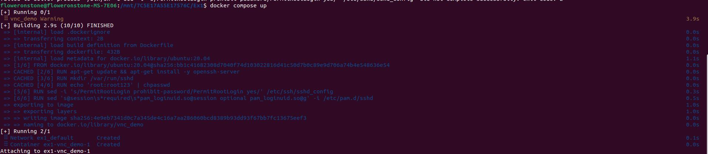
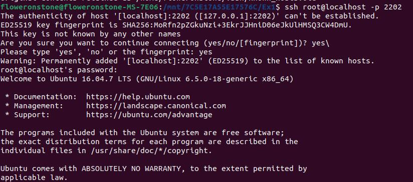
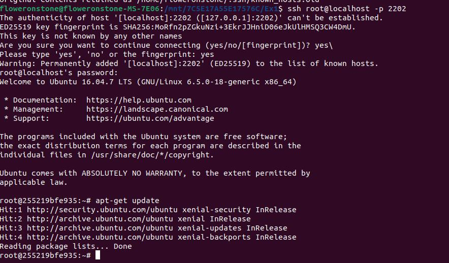
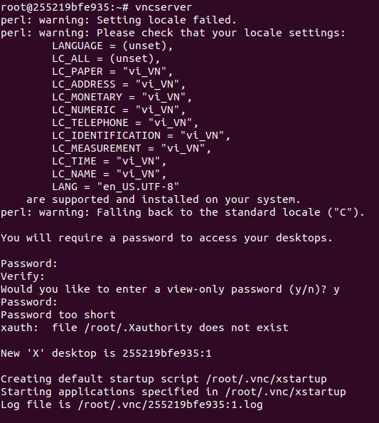
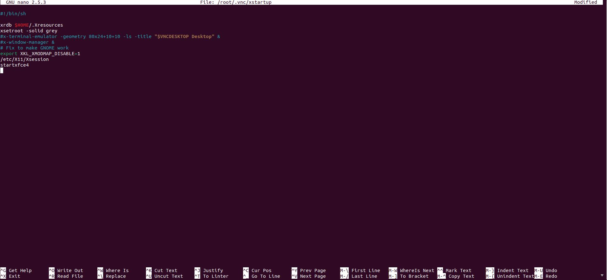
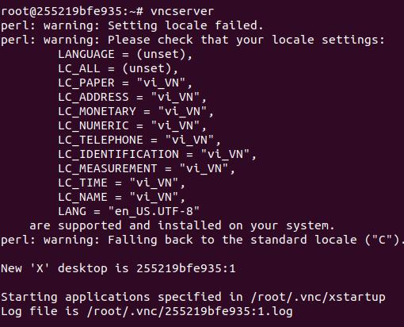
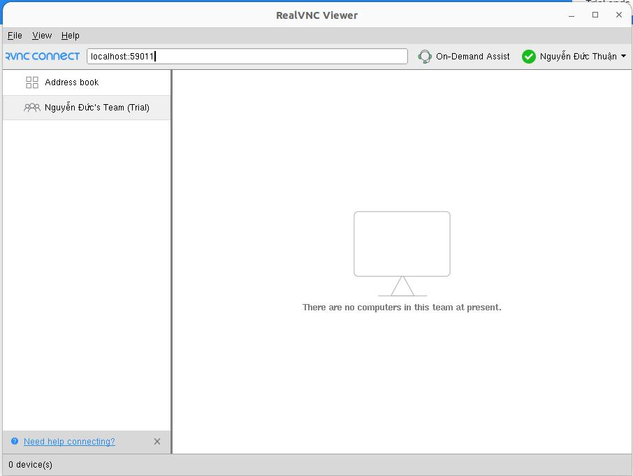
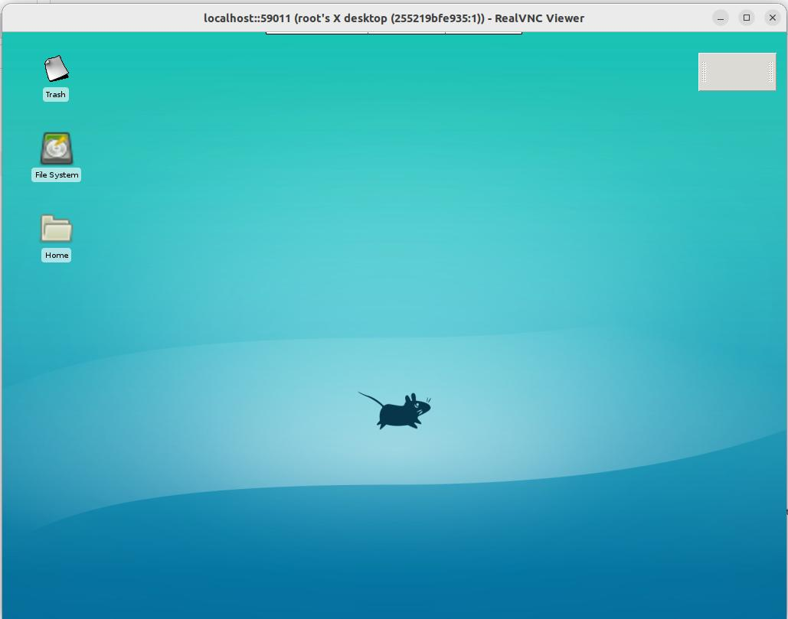

# Demo sử dụng Docker-Compose và VMC

## Cài đặt docker compose

Cài đặt docker compose thông qua lệnh sau:

```shell
sudo pip install docker-compose
```

## Viết Dockerfile

Để tạo ra một `container`, ta cần phải viết `Dockerfile` để định nghĩa `Image` và các câu lệnh cần chạy. Trong hình dưới là nội dung `Dockerfile` cho phép cài đặt và cấu hình cho `SSH`, đồng thời mở các `Ports` để truy cập từ xa.

```dockerfile
FROM ubuntu:16.04
RUN apt-get update && apt-get install -y openssh-server
RUN mkdir /var/run/sshd 
RUN echo 'root:root123' | chpasswd
RUN sed -i 's/PermitRootLogin prohibit-password/PermitRootLogin yes/' /etc/ssh/sshd_config
RUN sed 's@session\s*required\s*pam_loginuid.so@session optional pam_loginuid.so@g' -i /etc/pam.d/sshd
EXPOSE 22
EXPOSE 5901
EXPOSE 5902
CMD [ "/usr/sbin/sshd", "-D" ]
```

## Viết docker-compose.yml
Sau đó, để sử dụng được `docker compose`, trong project cần phải có file `docker-compose.yml`, định nghĩa các containers có trong project. Đồng thời ánh xạ các `port` của `container` với `port` của `host` để sử dụng cho `SSH`.

```yml
version: '3'
services:
  vnc_demo:
    build: 
      context: .
      dockerfile: Dockerfile
    image: vnc_demo
    ports:
      - "2202:22"
      - "59022:5902"
      - "59011:5901"
```

## Build image

Ta chạy lênh sau để build docker image
```shell
docker compose up
```



# Truy cập vào container thông qua SSH

Sử dụng port tương ứng với port 22 của localhost để truy cập vào container.

```shell
ssh root@localhost -p 2202
```



Chạy apt-get update để cập nhật các package.



## Cài đặt Desktop Environment và VNC Server

Trong demo này, Ta sử dụng Desktop Environment `Xfce4` và `Tightvncserver` để làm VNC server. Chúng được cài đặt thông qua lệnh sau:

```shell
apt install xfce4 xfce4-goodies tightvncserver
```

## Chạy VNC server

Run `vncserver` để tạo file `~/.vnc/xstartup` và tạo mật khẩu đăng nhập.



Kill process

```shell
vncserver -kill :1
```


Sửa file `~/.vnc/xstartup` và thêm  `startxfce4` vào cuối file. Việc này cho phép run xfce4 mỗi khi run server.



Run VNC server.



## Kết nối với VNC server
Sử dụng VNC Viewer để kết nối với VNC Server. Địa chỉ kết nối: localhost:<PORT> với PORT là port tương ứng với port 5901 của Container.



Nhập mật khẩu và kết quả nhận được như sau:


