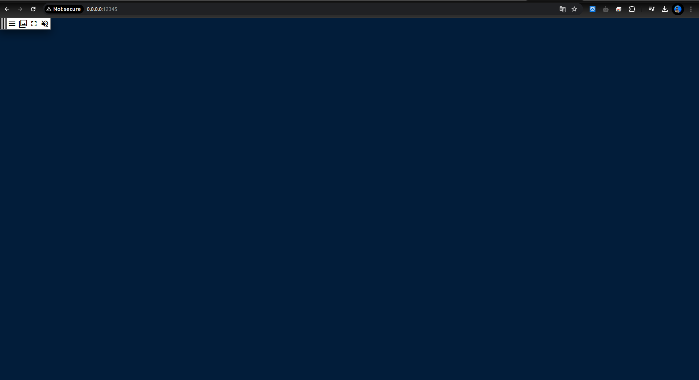

## Tỉm hiều về XPRA

X (Hệ thống cửa sổ X Window) là một hệ thống cửa sổ dành cho hiển thị bitmap, phổ biến trên các hệ điều hành giống Unix.

Xpra(X Persistent Remote Application) là một tập hợp các tiện ích phần mềm chạy máy khách X, thường là trên máy chủ từ xa và hướng màn hình của chúng tới máy cục bộ mà máy khách X không đóng hoặc bị mất bất kỳ trạng thái nào trong trường hợp kết nối mạng giữa máy cục bộ và máy chủ từ xa bị mất. 

Xpra khác với standard X forwarding chủ yếu ở chỗ cho phép ngắt kết nối và kết nối lại mà không làm gián đoạn ứng dụng được hiển thị. [3] Nó cũng khác với VNC và các công nghệ điều khiển từ xa tương tự ở chỗ không có root, vì vậy các ứng dụng được Xpra chuyển tiếp sẽ xuất hiện trên màn hình cục bộ dưới dạng các cửa sổ thông thường do trình quản lý cửa sổ cục bộ quản lý, thay vì tất cả đều bị đóng gói trong 1 ứng dụng. Xpra cũng sử dụng một giao thức tùy chỉnh có khả năng tự điều chỉnh và độ trễ tương đối không nhạy cảm, do đó có thể sử dụng được trên các liên kết kém hơn so với X tiêu chuẩn. 
Cảm hứng ban đầu để tạo ra Xpra đến từ kinh nghiệm ban đầu của tác giả khi cố gắng sử dụng nhiều thiết lập khác nhau dựa trên công nghệ NX.

Xpra kết nối dưới dạng trình quản lý cửa sổ tổng hợp với máy chủ hiển thị Xvfb . Tuy nhiên, thay vì kết hợp các hình ảnh cửa sổ để hiển thị trên màn hình, nó sẽ hướng các hình ảnh cửa sổ vào kết nối mạng tới máy khách Xpra, nơi chúng được hiển thị trên màn hình từ xa. Máy chủ Xpra cũng hỗ trợ đính kèm trực tiếp, khiến nó hoạt động như một máy chủ ứng dụng liên tục, chẳng hạn như trong trường hợp chỉ có một máy chủ X ở đầu xa.

Xpra cũng hoạt động như một trình quản lý cửa sổ cho máy chủ X mà nó đang chạy, nhưng trên thực tế, nó không có bất kỳ chính sách quản lý cửa sổ nào được tích hợp sẵn. Thay vào đó, nó nhận tất cả các yêu cầu quản lý cửa sổ từ các ứng dụng, gửi chúng qua mạng cho khách hàng, sau đó đưa ra các yêu cầu tương tự trên màn hình thực, chờ câu trả lời thêm mà trình quản lý cửa sổ thực đưa ra rồi chuyển tiếp câu trả lời đó trở lại. máy chủ Xpra. Ngoài ứng dụng khách Xpra thông thường, nó còn hỗ trợ sử dụng trình duyệt web có khả năng HTML 5 làm ứng dụng khách.

## Docker file 

Nội dung
```
FROM ubuntu:22.04

ENV DEBIAN_FRONTEND=noninteractive

RUN apt-get update && \
	apt-get -y install xpra && \
	apt-get -y --purge autoremove && apt-get clean && rm -rf /var/lib/apt/lists/* /tmp/* /var/tmp/*

EXPOSE 10000
ENTRYPOINT ["xpra", "start",":100","--pulseaudio=no","--start-child=\"$*\"","--bind-tcp=0.0.0.0:10000","--no-daemon","--exit-with-children"]
```

Build image
```
docker build -t easy_xpra .
```

Run container
```
docker run -p 12345:10000 -ti easy_xpra
```

Url: 'http://0.0.0.0:12345/'

Kết quả



